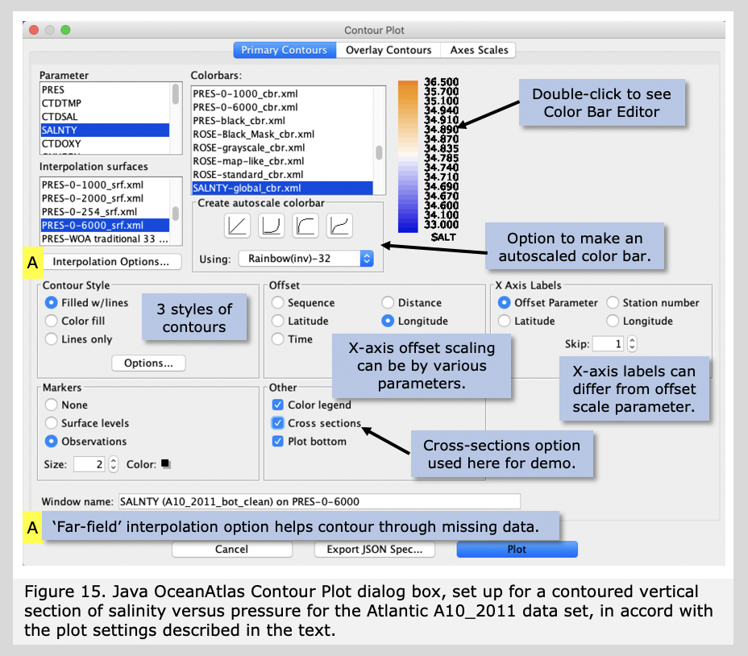
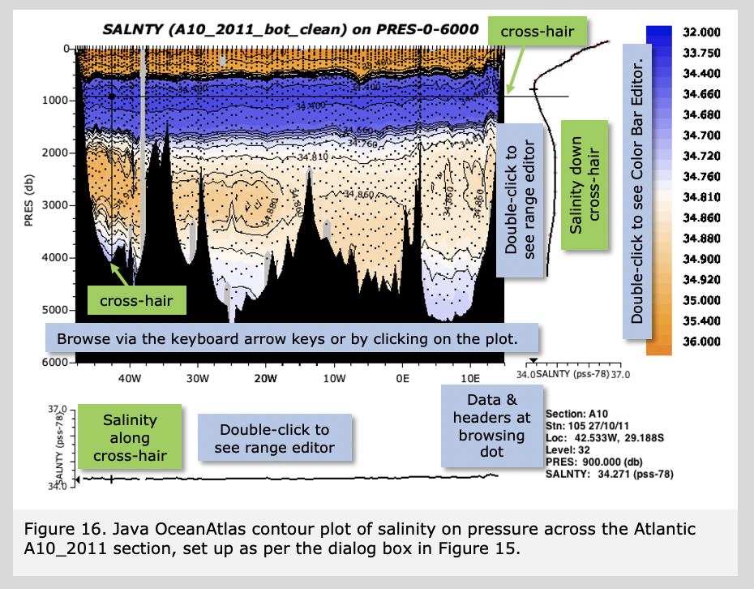

Java OceanAtlas provides a variety of contoured plots (vertical section plots where contours or colors correspond to property values). The most commonly used are contour plots of parameters (i.e. sections of salinity, oxygen, etc.) with pressure as the vertical axis. 

To contour data Java OceanAtlas uses data interpolated onto standard levels of the parameter to be used as the vertical axis. (JOA does the interpolation in the background while the plot is being generated.) The Java OceanAtlas Contour Plot dialog box permits you to choose the <b>'Parameter'</b> to be contoured, the <b>'Interpolation surface'</b> or standard levels of the vertical axis parameter to interpolate upon, and the <b>'Color bar'</b> scheme to be used, and also contains a wide range of optional plot customization features.

Note: Once these three aspects of a contour plot have been specified -  parameter, interpolation surface, and color bar - the 'Plot' button will be active - no further customization is required by JOA.

Pull down the Plots menu and select 'Contour...'. This will bring up the Contour Plot dialog box. Select SALNTY from the 'Parameter' column, and PRES-0-6000_srf.xml from the list of 'Interpolation Surfaces'. From 'Color bars' scroll down the list until you can see SALNTY-global_cbr.xml and select it.

As noted, these three choices alone are sufficient to generate a JOA contour plot, but we will customize this plot a bit:
	
<ul>
<li>To make the horizontal axis longitude, instead of the default 'distance' (cumulative station-by-station distance), click the 'longitude' choice under 'Offset'.</li>
<li>To have the contour plot show where the water samples were located select 'Observations' from the 'Markers' choices.</li>
<li>To enable full profile and level browsing of the contour plot select 'Show Cross Sections' from the 'Other' choices. (This plot option adds unique interpretative information to a JOA contour plot.)</li>
</ul>

Figure 15 shows the Contour Plot dialog box as it should appear from these selections.

     

Now click 'Plot' and the contour plot will be drawn. See Figure 16.

   

There are five segments to the plot window in Figure 16: the contoured plot, a color/contour bar, a vertical profile, a cross-section profile, and a data display. The contoured plot begins with the first station in the data set (in these data the west-most station) and ends with the last (in this case east-most), with the stations plotted along their longitudes (appropriate for a west-to-east section). The color transitions correspond to the selected salinity color bar. The ocean bottom was read from the data set, converted to 'pressure', and plotted.

If you now use the arrow keys on your keyboard, you will discover the vertical and horizontal browsing lines. These 'cut through' the gridded data to create the vertical and cross section profiles shown in the window segments to the right and bottom of the contour plot, i.e. these profile windows show vertical and horizontal plots of the data along the browsing lines, and the data display at the lower right provides information germane to these plots.

Double-clicking on the contour plot brings up a dialog box to make changes, for example to the Y-axis range and in some of the display options. And double-clicking on either of the cross section plots brings up dialog boxes to adjust their scales.

Try browsing this plot, using the arrow keys on your keyboard. Notice how the profiles in the side and top panels work? Also try clicking on the image of the section in the main Data Window. See how the browser cross-hairs move? All open plots and the data window are linked, although in the case of contour plots, which are contoured interpolations onto standard surfaces, Java OceanAtlas can only make the closest match to the nearest observation.

 

The contoured salinity plot (Figure 16) shows the high salinity surface waters, strong salinity minimum from the Antarctic Intermediate Water, weaker but broad and western-intensified deep salinity maximum, and the lower-salinity bottom waters from the Antarctic. Notice how the Mid-Atlantic Ridge divides the deepest waters: the relatively fresh (and cold) Antarctic Bottom Water signal is very much stronger on the western side of the section (in the Brazil Basin) than it is on the eastern side (in the Angola Basin). This is an unmistakable sign that east of the Mid-Atlantic Ridge the deepest waters are geographically - oceanographers would say 'bathymetrically' - more nearly isolated from the source of Antarctic Bottom Water than is the case west of the ridge. Indeed, if you take a look at a bathymetric chart of the South Atlantic Ocean (your station map [Figure 3] should be adequate), you will see that the Angola Basin is bounded on the south by the Walvis Ridge, without a deep passage to the Antarctic circumpolar zone, whereas the Brazil Basin has a much deeper connection to the south.

 

If you would like to learn more about the characteristics of the ocean waters across the Atlantic A10 section, make contour plots against pressure (PRES-0-6000_srf.xml works well) of potential temperature (THTA), dissolved oxygen (OXYGEN), silicate (SILCAT), nitrate (NITRAT), and phosphate (PHSPHT). We designed the 'global' color bars for each parameter to show the primary features of each parameter over the World Ocean, so they are good choices. But also feel free to experiment with color bars, such as the choices under 'Create autoscale color bar', where you can choose any end points. The linear button there often produces good results. Our choices are sometimes not linear, and the equal-spaced divisions you get from a linear-autoscale color bar will help point out the principal gradients in each water property. We did not use linear ranges because for most properties the principal variation is in the upper-most layers, and so linear-autoscale color bars often do not reveal deep features as clearly as would our custom color bars. The Atlantic A10_2011 data also include CFCs, SF6, and ocean carbon observations, and we supply global color bars for these parameters.

