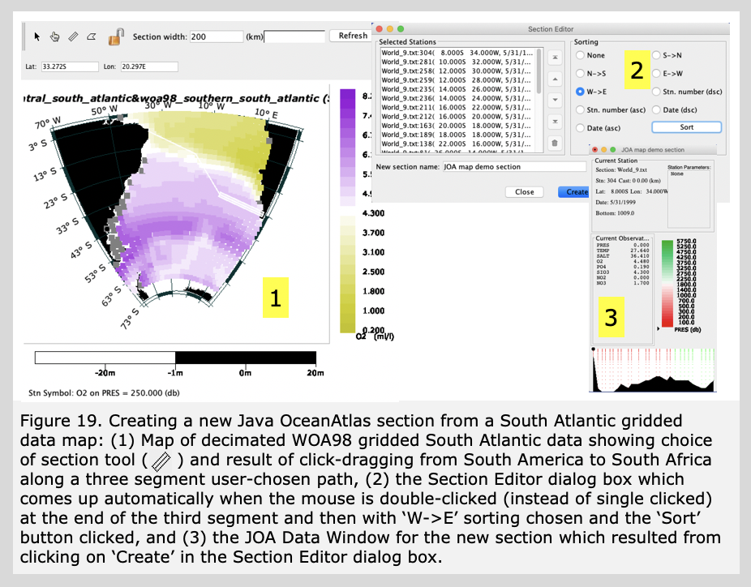

Java OceanAtlas provides optional functions in the Configure Map Plot dialog box to permit the station symbols on map plots to be colored by the current value of any parameter, interpolated onto any surface (typically a pressure surface), and colored via autoscale or by any color bar (almost always a color bar for the parameter being colored). This feature will work with any data. But the feature is illustrated most effectively when it is used with gridded data.

As noted earlier in the Guided Tour, in terms of making easy-to-understand plots, it can be challenging to map oceanographic data. For example, making a contoured map of salinity at a level of 750 decibars (approximately 746 meters) for the South Atlantic Ocean with a collection of typical oceanographic station/profile data results in a choppy-looking map with many 'bull's eyes' if the map is made by automatic contouring. The maps of properties in the printed atlases available in oceanographic libraries were made by hand contouring data with a trained oceanographic 'eye'. In recent years application of objective analysis techniques have considerably aided making contoured maps from disparate data, but even then results can be unrealistic. To make autocontoured water property maps which are visually appealing and oceanographically useful, it is best to use data which are already gridded, for example output from computer models, or one of the gridded data sets created by oceanographers.

In 1982, Syd Levitus published initial results of his NOAA project to sensibly assemble collections of quality-controlled oceanographic data at the sea surface. With colleagues at NOAA, this led to the 1994 publication of mean temperature, salinity, dissolved oxygen, and nutrient data on 33 standard level surfaces on a 1-degree positional grid for the World Ocean. This first edition of what is known as the World Ocean Atlas was repeatedly updated and reissued, now typically abbreviated WOAyy, where yy is the two-digit year of publication: The JOA Suite has selections from WOA98, WOA05, WOA09, WOA13, and WOA18. (WOA18 has 102 standard levels.) The WOAyy multi-year annual average objectively analyzed gridded data files are the 'mean ocean' data often used in ocean models. These are extremely valuable and versatile statistical data compilations, although the combination of averaging and gridding make WOAyy data different from those from measured profiles. We have taken these standard level annual flat fields and reassembled them into vertical profiles at up to one degree geographic resolution. The JOA Suite also includes some gridded WOA seasonal data files.

Next we will combine two WOA98 data files from the South Atlantic Ocean and use the combined data file to try out some Java OceanAtlas map features.

Open the 'woa98_central_south_atlantic.joa' data set in Java OceanAtlas. (It is not necessary to close other data sets open in Java OceanAtlas other than to free up the memory Java OceanAtlas uses - sometimes this is a lot of memory - for the other data sets.) Now, using the 'Add Data' command under the 'File' menu, add the 'woa98_southern_south_atlantic.joa' data set. Finally, save this new file you created. Under the 'File' menu, select 'Save As' and name the new file South_Atlantic_grid.joa. We will be using this file later on in the tutorial and referring to it by this filename.

Note that the WOAyy data files, except for those from WOA18, have their dissolved oxygen data in traditional volume units (ml/l), which are numerically roughly 1/43rd those in the mass units (µMol/kg) used in most modern data. We will use JOA color bars pre-scaled for oxygen in volume units to examine the WOA98 data.

Select 'Map' from the Plots menu and set up the dialog box for a Stereographic Projection with a South Atlantic Preset Region; set the Symbol 'Size' to 10; change the 'Latitude Spacing' to 10 and the 'Longitude Spacing' to 20. In the 'Bathymetry' tabbed panel select the etopo20.nc bathymetry file ('Color Fill Bathymetry should be automatically selected) and the ROSE-Black_Mask)cbr.xml Colorbar. In the 'Station Colors' tabbed panel select Iso-surface, and select O2 for 'Parameter', O2-global.cbr for 'Colors' and PRES-0-6000_srf.xml for 'Surface', and the )2. -global-vol-traditional_cbr.xml color bar. The three panels of the dialog box set up this way are shown in Figure 17.

Now click 'Plot' and the map plot will be drawn. See Figure 18.

You can see at once that gridded data can make a useable map. Java OceanAtlas lets you browse these maps with the up and down arrow keys to examine properties over the whole range of the chosen surface, in this case 0-5500 decibars.

The station position map plot with station symbols colored by oxygen interpolated onto pressure surfaces (Figure 18) shows that at the surface (left plot in Figure 18) oxygen concentrations are highest in the far south. Those surface waters are colder and have a greater capacity to hold dissolved oxygen than do the warmer waters in the subtropics and tropics. At 250 decibars (right plot in Figure 18), you can see the great band of low oxygen water in the tropics and against the west coast of Africa. There, biological material from above has 'rained' into the waters underneath the euphotic zone where it decays and depletes oxygen. The degree to which this depletes oxygen is also dependent upon the rate of resupply of water to that region from remote, better-oxygenated regions. If you browse down to deeper levels you will see the effects of the submarine ridges, and many of the features seen previously across the Atlantic A10 section.

Java OceanAtlas map plots have features that provide the capability to make new sections - new Java OceanAtlas data files - directly from the map plots. Because this feature works so well with gridded data, and because it can be useful to be able to make a section across a region, here are some instructions how to do this (illustrated in Figure 19).

On your map plot of the South_Atlantic.grid.joa data, click on the section selection tool (the third of the four tools in the upper left of the map plot). Now move your mouse pointer to the east-most point of South America (this map location is mentioned only to match the example), click once and move the mouse to the right. You should see a set of three parallel lines extending across the map. Now click once and continue to drag, shifting your track (we shifted south and slightly east in our example). Now click once and shift your track, this time taking the section selection lines over to Africa. Because we want this last point to be the end of our new section, double-click at this last position instead of single clicking. If all went well, the Section Editor dialog box should pop up.

In the Section Editor dialog box, Java OceanAtlas presents a list of all the stations it found along your track. Java OceanAtlas does not always auto-sort this list in the order you want your stations to appear, or it may include stations you didn't want. You can edit this list in many ways. Here, for the selection we made in Figure 19, we just selected the 'W->E' 'Sorting' choice and then clicked the 'Sort' button.

Click 'Create' in the Section Editor dialog box and the Data Window for your new section should appear, all ready for plotting.

Your exact results will depend on the path you chose and the 'Section width' setting (you can change it) in effect when you used the section selection tool in the map plot. Wider section widths will pick up more stations along the path. Remember, Java OceanAtlas is working from only the center of each station symbol, not the full size of enlarged symbols. Also, it can be frustrating to use the selection tool until you come across the 'click-drag-click-drag-click-drag-doubleclick' sequence, the feel of which may be affected by the mouse (or equivalent) settings for your computer.

Referring to the symbols at the upper-left of Java OceanAtlas map plots, the 'arrow' tool choice on the section-maker is used to select a region of stations in the traditional click-drag-click selection box motif used in most graphic applications. The 'hand' tool choice lets you select individual stations, with multiple stations selected by holding down the 'shift' key on the keyboard until all the desired stations are selected, and the polygon tool lets you draw an irregular polygon around the stations you wish in your data subset (double-click to complete the polygon selection).

In the Section Editor dialog box stations can be selected (by clicking on them) and moved up or down the list to change their sequence, moved to the top or bottom of the list, or deleted. Stations can also be geographically sorted by selecting one of the sorting directions and clicking on 'Sort' as in the example here. If you wish, you can type in a name for your new section before clicking 'Create'.

    
     
    
        
<h1>Guided Tour of Java OceanAtlas</h1>
<ul>
<li><a href="1.html">Basic Features</a></li>
<li><a href="2.html">Starting JOA</a></li>
<li><a href="3.html">Station Maps</a></li>
<li><a href="4.html">Profile Plots</a></li>
<li><a href="5.html">Changing Color/Contour Bar</a></li>
<li><a href="6.html">Calculate Parameters</a></li>
<li><a href="7.html">Property-Property Plots</a></li>
<li><a href="8.html">Browsing</a></li>
<li><a href="9.html">Modifying Plots</a></li>
<li><a href="10.html">Extracting Selections</a></li>
<li><a href="11.html">Contour Plots</a></li>
<li><a href="12.html">Other Features</a></li>
<li class="active"><a href="13.html">More About Maps</a></li>
<li><a href="14.html">How to Filter Your Data</a></li>
<li><a href="15.html">Final Remarks</a></li>
<li><a href="16.html">Java OceanAtlas Data Files</a></li>
</ul>
