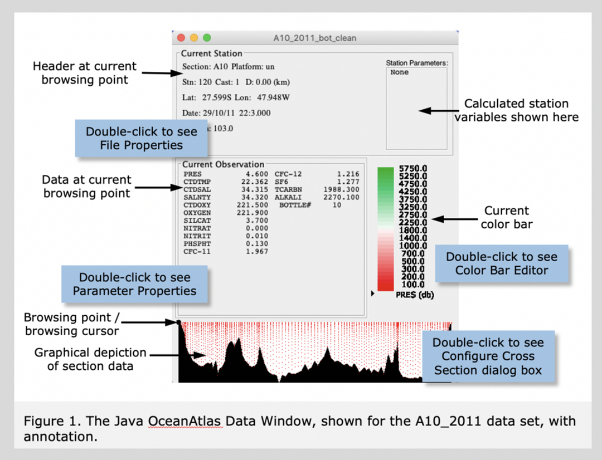

Start the Java OceanAtlas application (e.g., by double-clicking on its icon). You will see a small window.<ul> 
	<li>On Windows and Linux, JOA's menu bar is contained in the initial Data Window in adherence to Windows UI conventions.</li>
	<li>On Mac OS X, JOA's menu bar is at the top of the screen in adherence to Apple's UI conventions.</li>
	</ul>
		 
	Use the 'Open…' command under the JOA File menu to locate and open the A10_2011_bot_clean.joa data file. A standard JOA Data Window will open (Figure 1).  
    
  
The Data Window provides a common reference for the Java OceanAtlas plots. As we will see in section labeled 'Browsing', parts of it act like a movable magnifying glass on the data set. The Data Window can be moved anywhere on your monitor by click/holding on the title bar and dragging it.  

If you are new to oceanography you might not be aware that one of the methods oceanographers utilize to collect information about the origin and circulation of ocean waters is to occupy - from a research vessel - a line of 'stations' across a region of interest. Such a line is usually called a 'section' (short for 'cross section'). A station is a location where the ship stops and takes observations, in this case of the physical/chemical characteristics of the water column. (There are many different types of oceanographic expeditions and observations. Here we focus on the types which produce the data Java OceanAtlas was designed to explore.)  

Water column measurements made from the end of the 1800s through the 1970s were typically made by attaching water bottles (with open lids at each end) onto a wire lowered into the ocean. When all the bottles were deployed at the intended levels a 'messenger' (brass weight) was dropped down the wire. When a messenger reached a water bottle it closed the bottle, caused a deep-sea reversing thermometer to reverse (and thus break the mercury column and preserve its temperature reading), and release another messenger to head down to the next bottle, and so on.  

Beginning in the early 1970's a new device, the rosette water sampler, began to replace bottle-on-wire casts. The rosette is frame which holds a CTD (an electronic profiling device which samples Conductivity, Temperature, and Depth [actually, pressure is sampled, not depth]), ca. 12-36 water sampling bottles, a central bottle-closure-control mechanism, and sometimes other equipment. The frame is usually attached to an armored cable containing one or more conductors, and can be lowered into the ocean. An operator on the ship can communicate with the underwater package via the conductor in the cable. Typically the CTD profiles are collected as the rosette descends and the water samples are collected (by closing the bottles by electronic remote control) on the up cast, along with recordings of CTD values at the times each bottle is closed. The CTD typically supplies the temperature and pressure at which a bottle is closed, and laboratory analyses for other parameters are made from the water collected in the closed bottles. Typically - but not always - salinity, oxygen, and the inorganic nutrient salts nitrate (NO3; usually analyzed as 'NO3 + NO2', with NO2 - which is usually very small - being subtracted out after running analyses for it alone), phosphate (PO4), and silicate (SiO3) are routinely analyzed from the water samples. In recent years increasing attention has been given to analyses of what some physical oceanographers initially called 'tracers' (although temperature, salinity, oxygen, and nutrients made excellent tracers, too; it's just habit and nomenclature). These include substances such as CFCs, ocean carbon parameters, tritium, helium, radiocarbon, and so on. The list recognized by the WOCE Hydrographic Program Office in the 1990s contained 48 parameters plus 12 ancillary measurements.  

Physical oceanographers studying the large-scale water masses tend to make the most consistent use of temperature, salinity, oxygen, and nutrient data from full-depth profiles, and so we have the most data over the longest period of time for those parameters. Basin-scale work requires basin-spanning data. And so many of the great oceanographic sections cross major basins, include full-depth stations whose horizontal and vertical resolution are reasonably well matched to large ocean scales, and include the full suite of routine hydrographic data. These form the backbone of the ocean data sets included with Java OceanAtlas. We tend to focus on the bottle data in OceanAtlas because these are relatively compact, cover the large-scale fields well, and include many parameters of interest.  

Key sections from the 1990s WOCE Hydrographic Program were repeated during the early 2000s during CLIVAR Repeat Hydrography. Many of those repeated sections continue to be reoccupied from time to time as part of international GO-SHIP.  

The "A10" section of 120 full-depth T/S/O2/nutrient/CFC/SF6/carbon stations in the South Atlantic Ocean along ca. 30°S from Africa to South America was occupied by scientists from US institutions during 26 September to 31 October 2011 from the NOAA research ship Ronald H. Brown. It is a good Java OceanAtlas demonstration section because it crosses an interesting ocean region, and the data are of good quality and reasonably complete. We have reversed the station order so that Java OceanAtlas will display the section from west on the left to east on the right.
	  
	West-to-east and south-to-north are preferred for left-to-right section orientations by the author (Swift) and many of his colleagues at the UCSD Scripps Institution of Oceanography. Many of the Java OceanAtlas data files are organized to reflect this preference.

