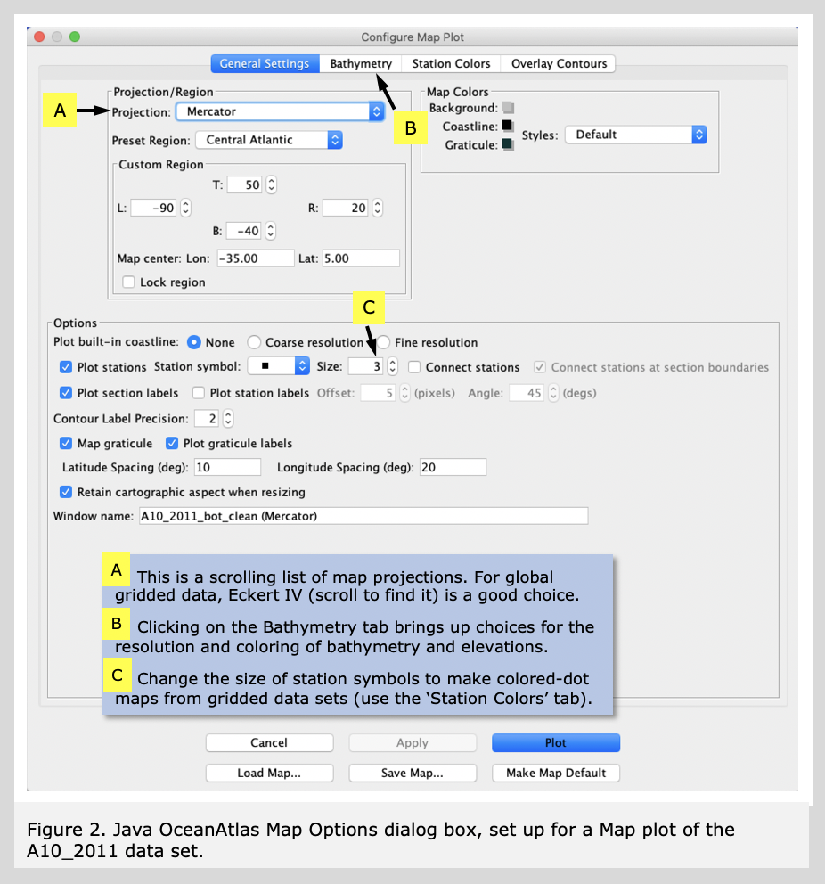

Plots are the heart of the application. One of the first questions you might have would be &lsquo;where are these data located?&rsquo; Java OceanAtlas includes station maps.  
	Select &lsquo;Map...&rsquo; from the Plots menu. The will bring up the Configure Map Plot dialog box.

	We have configured the dialog boxes for each JOA plot type so that a basic plot can be made with a minimum of user input.
	  
	For a JOA map plot, no further user inputs are required: the &lsquo;Plot&rsquo; button is activated, meaning a basic map plot will be drawn by clicking on the &lsquo;Plot&rsquo; button.

	In this Guided Tour we show some basic plot customization features:  
	Select the &lsquo;Miller&rsquo; projection from the scrollable list of projections.
	  
	Select the &lsquo;Central Atlantic&rsquo; preset region. In the 'Latitude spacing (deg)&rsquo; and Longitude spacing (deg)&rsquo; boxes select the pre-set text and type in '10&rsquo; and '20&rsquo;, respectively. Java OceanAtlas maps include default bathymetry based on the ETOPO60 one-degree coarse grid: click the 'bathymetry&rsquo; tab to see this (on a new copy of JOA it is set up this way by default). The dialog box should look like the examples in Figure 2.
   

Then click 'Plot'. You will see a map with the stations, shaded land masses, gray bathymetry, and a latitude/longitude grid, as shown in Figure 3.  
      
Map plots show individual dots for each station, with a different station color for each section subset. (JOA determines this coloring for reasons mostly ignored here, for example when there is more than one section opened.) In Figure 3 the apparent 'cruise line' is actually a series of 80 individual station dots. The map window is scrollable and resizable. (You may need to click on the 'Reset' button in the map plot window to force a redraw.) Selecting a subset of the plot by click-dragging the cursor will produce a subset of the map plot covering only the selected area. [Sometimes, due to a Java quirk, the new map subset plot is initially hidden under the original map plot window.]

		
     
		
        
<h1>Guided Tour of Java OceanAtlas</h1>
<ul>
<li><a href="1.html">Basic Features</a></li>
<li><a href="2.html">Starting JOA</a></li>
<li class="active"><a href="3.html">Station Maps</a></li>
<li><a href="4.html">Profile Plots</a></li>
<li><a href="5.html">Changing Color/Contour Bar</a></li>
<li><a href="6.html">Calculate Parameters</a></li>
<li><a href="7.html">Property-Property Plots</a></li>
<li><a href="8.html">Browsing</a></li>
<li><a href="9.html">Modifying Plots</a></li>
<li><a href="10.html">Extracting Selections</a></li>
<li><a href="11.html">Contour Plots</a></li>
<li><a href="12.html">Other Features</a></li>
<li><a href="13.html">More About Maps</a></li>
<li><a href="14.html">How to Filter Your Data</a></li>
<li><a href="15.html">Final Remarks</a></li>
<li><a href="16.html">Java OceanAtlas Data Files</a></li>
</ul>
