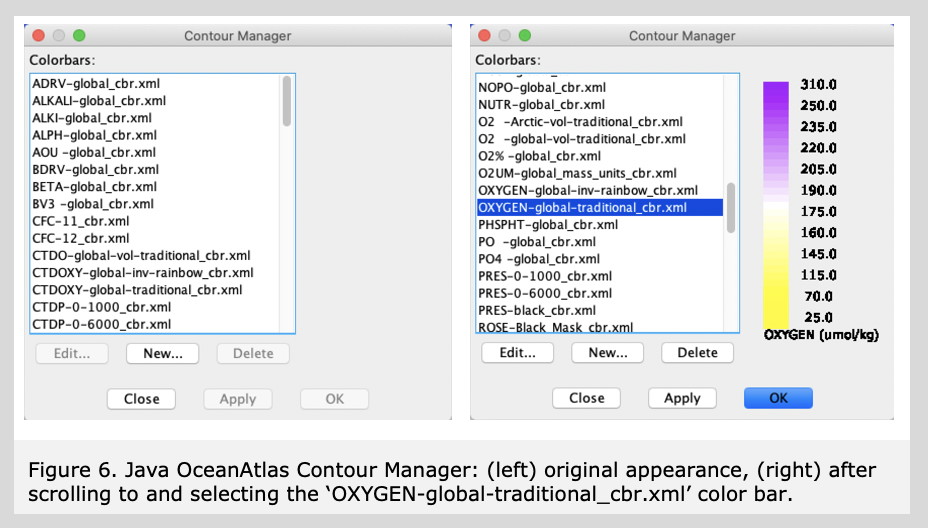
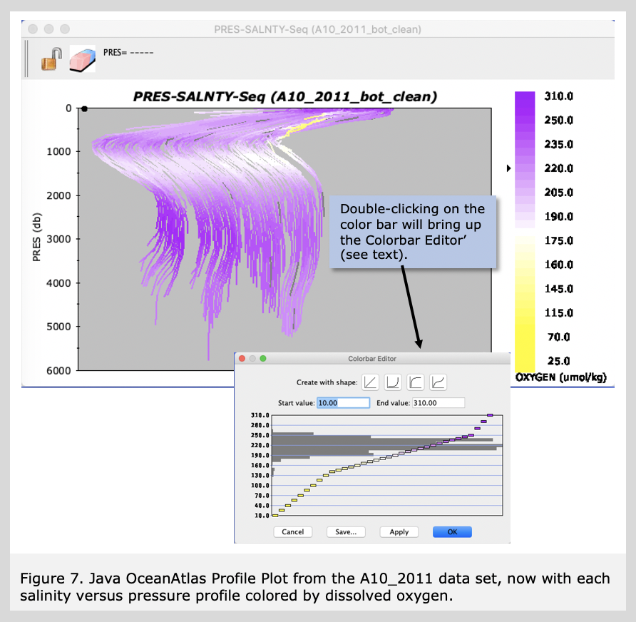

A favorite feature of Java OceanAtlas is the coloring of plotted data by ranges of any parameter for which there are data and for which there is a color/contour bar. We supply an assortment of useful color/contour bars with the application, and we also include a creator/editor sub-application, called the Contour Manager (under the Resources menu). The easiest-to-use feature of the Contour Manager is using it to change color/contour bars, which is what we will do next, because coloring by pressure on a pressure-based plot (as above) added little to that plot.  
 To change the 'colored' parameter (the one shown in the Data Window), pull down the 'Resources' menu and select 'Contour Manager...'(see Figure 6).

  

This dialog box opens up a host of possibilities, but we'll stick to the easiest: try selecting one of the other color bars provided, for example 'OXYGEN-global-traditional_cbr.xml'. You will see the new color bar and contour intervals displayed in the right portion of the Contour Manager (as shown in Figure 6). Click 'Apply' and you will see the plot(s) underneath updated to preview your selection. Try a few others, then return to oxygen. Click 'OK', and all active plots are re-colored, this time by the new color/contour bar (Figure 7).

Note about dissolved oxygen units and JOA

For decades, oceanographers used dissolved oxygen data in the 'volume' units ('ml/l' = milliliters of dissolved oxygen per liter of seawater) which were the reported results the analyses. With the World Ocean Circulation Experiment (WOCE) in the 1990s, chemists recommended that these data be reported in 'mass' units ('µMol/kg' = micromoles of dissolved oxygen per kilogram of seawater). These values are numerically different by a factor of roughly 43. The dissolved oxygens in many older data and the NOAA World Ocean Atlas gridded data editions from 1998, 2005, 2009, and 2013 are in the traditional volume units, whereas the data from WOCE and its follow on programs CLIVAR Repeat Hydrography and GO-SHIP (and the 2018 edition of the NOAA WOA data) are in mass units.

JOA is equipped to work with dissolved oxygen data in either volume or mass units, but this does lead to some complexity in the color bars. Mostly, we have made color bars with 'OXYGEN' scaled to work with oxygen in mass units, and those with 'O2' scaled to work with oxygen in volume units. One exception is the color bar 'O2UM' which is made to work with oxygen in mass units, especially in the data files from the 2018 edition of the World Ocean Atlas gridded data.

You have added a new dimension to your profile plot. You can see in Figure 7 that the very uppermost waters are relatively high in oxygen concentration, but immediately underneath - above the salinity minimum - there is a strong oxygen minimum, especially in the east. The sluggish circulation in this portion of the water column in this area tends to ventilate the layer slowly, leaving biological debris raining down to use dissolved oxygen as it decays. But in the North Atlantic Deep Water (NADW) layer at ca. 2500-3000 decibars, especially on the west, dissolved oxygen concentrations are relatively high. This layer is ventilated effectively in the Labrador Sea and from the dense outflows from the Nordic Seas which spread southward, especially along the western boundary. As the NADW layer spreads southward it ventilates a great band of deep water found throughout much of the World Ocean.

Helpful note: As demonstrated in Figure 7, you can make quick changes to the range or interval shape of any color bar - on a plot or in most dialog boxes - by double-clicking on it. This brings up an interface to change the limits and interval ramping style ('shape') of that color/contour bar. One of the four 'Create with shape:' buttons must be clicked on to put range changes into effect. Changes may then be saved, applied (with dialog box remaining open), or OK'd.

