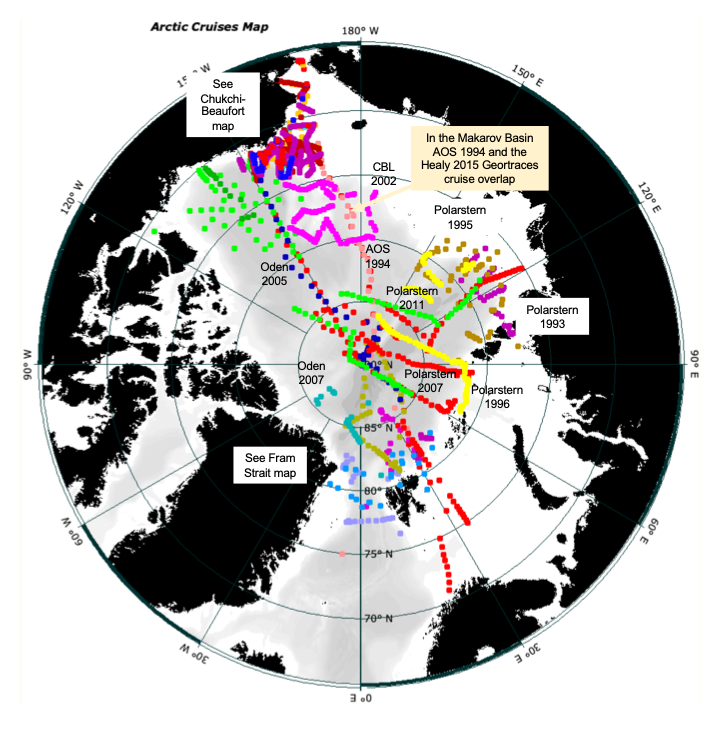

<section id="hero">
	

		<h1>Explore {{page.ocean}} Ocean Data</h1>
		<h2>Navigate to your desired data below</h2>
		<!--# 
<a class='button-func' href="#tree-search"> Tree Search </a>
 -->
		

	

</section>
<!-- #hero -->
<section id="call-to-action1">
	<section id="call-to-action3">
		

			

				<h3 class="cta-title1" style="text-align:center">About {{page.ocean}} Ocean Data</h3>
				 
				
Vertical section data from Arctic Ocean and Nordic Seas expeditions from J. Swift's files. The data values for measured parameters are unchanged (with one exception), but the files have been vetted and groomed for improved readability and consistency, and assembled in sensible geographic order.

			

		

	</section>
</section>
<!-- #call-to-action -->

		

			
 Pick a Search Functionality

			
<a class='button-func' href="#tree-search"> Tree Search </a>
			<a class='button-func' href="#dropdown-search"> Dropdown Search </a>

			

			
 Dropdown Search

			<section id="dropdown-search">
			

				

					

						

							

								<h6>What data are you looking for?</h6>
								

									

									<form style="margin-left: auto;" action="#" method="get">
											<select class="custom-select" id="verticalSectionDropdown">
												<option value="All" selected="selected">Section</option> 
												
												<option value="{{item.title}}">{{item.title}}</option>
												
												
												<option value="{{entry.year}}">{{entry.year}}</option>   
												 
											</select> &nbsp;&nbsp;&nbsp;&nbsp;&nbsp;&nbsp;&nbsp;

											<select style="display:none" class="custom-select" id="yearDropdown">
												<option value="All">Year</option> 
												<option value="{{item.year}}">{{item.year}}</option>  </select> &nbsp;&nbsp;&nbsp;&nbsp;&nbsp;&nbsp;&nbsp;
											<select style="display:none" class="custom-select" id="fileDropdown">
												<option value="All">File</option>
												<option value="Basin">.csv</option>
												<option value="Sub Basin">.jos</option>
												<option value="Option_3">.txt</option>
												<option value="Option_4">.joa</option>
												<option value="Option_5">.zip</option>
											</select>
									</form>
									

								

							

						

					

				

			

			</section>
		

			

				

					

						

							<table>
								<thead>
									<tr class="row100 head">
										<th class="cell100 column1">Section</th>
										<th class="cell100 column4">File</th>
									</tr>
								</thead>
							</table>
						

						

							<table class="table" id="datatable1">
								<tbody id="datatable">  
								
								
								<tr>
										<td class="cell100 column1">{{item.title}}</td>
										<td class="cell100 column4"><a href="{{entry.path}}">{{entry.name}}</a></td>
								</tr>
								
								
								
									<tr>
										<td class="cell100 column1">{{entry.year}}</td>
										<td class="cell100 column4"><a href="{{file.path}}">{{file.name}}</a></td>
									</tr>   
								</tbody>
							</table>
						

					

				

			

	

	
 Data Tree Search

	<section id="tree-search">
	

			<ul> <b>{{page.ocean}} Ocean</b>
				<ul>
					<li> Download all {{page.ocean}} Data</li>
					<li><a href="assets/documents/Guide to the Best Data Arctic directory.pdf">Guide to Arctic Ocean and Nordic Sea files</a></li>
					
					<li> <i class="fa fa-plus-square" style="color:white"></i>{{item.title}}
						<ul>
								
								
							    <li><a href="{{entry.path}}">{{entry.name}}</a></li>
								
								
								
								<li> <i class="fa fa-plus-square" style="color:white"></i>{{entry.year}}
								<ul> 
								<li><a href="{{file.path}}">{{file.name}}</a></li>  </ul>
								</li> 
								 
								
						</ul> 
					</li>  
				</ul>
			</ul>
	

	</section>

