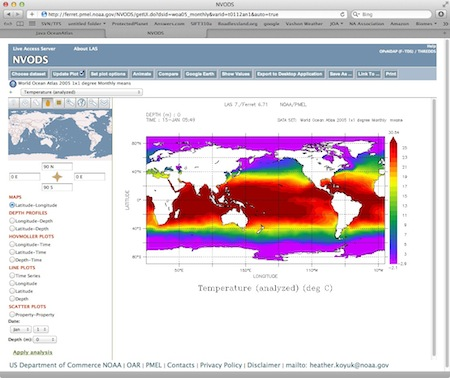
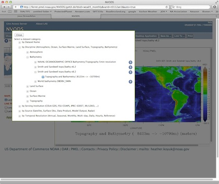
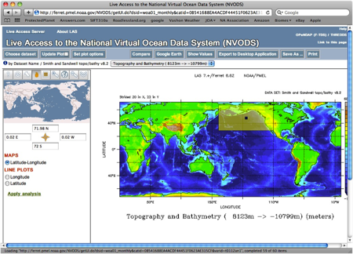
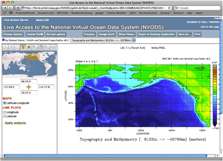
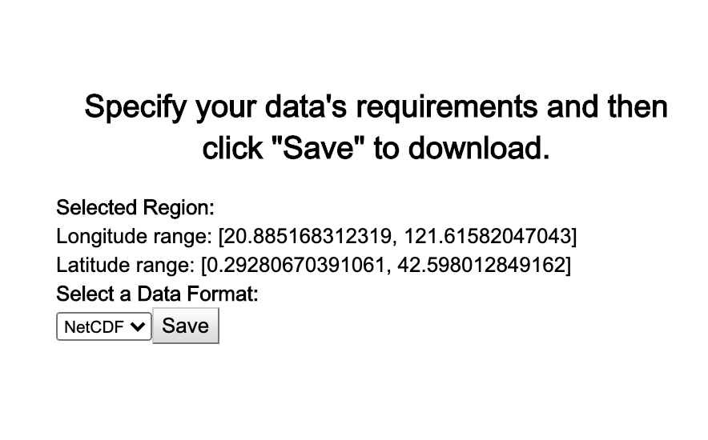
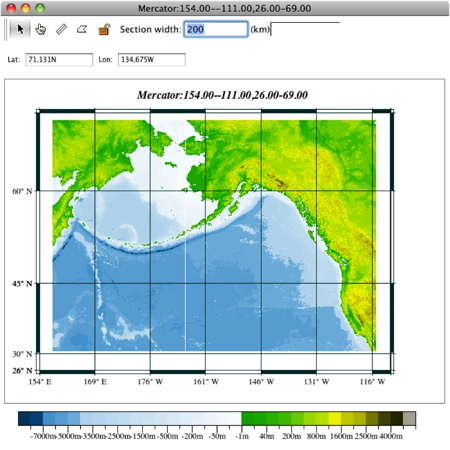

	<h1>Java OceanAtlas Application</h1>
  

	<h2>{{page.title}}</h2>

  <h2>To use:</h2>
  <ul>
    <li>Downloaded files should be installed in the JOA_Support folder found in your JOA installation folder.</li>
    <li>You will see the files you downloaded in the "Bathymetry" panel of the map plot dialog box. You can use any of the "ROSE" colorbars to color the bathymetry.</li>
    <li>You can use more than one etopo file for any map plot by command-clicking.</li>
  </ul>

  <h2>Etopo-5</h2>
  <ul>
    <li><a href="https://cchdo.ucsd.edu/data/16345/etopo5_all_8_files.zip" class="joa_link">All 8 regions</a> (15.3 MB)</li>
    <li><a href="https://cchdo.ucsd.edu/data/16352/etopo5ArcticNew.nc" class="joa_link">Arctic</a> (6.0 MB)</li>
    <li><a href="https://cchdo.ucsd.edu/data/16346/etopo5_ant.nc" class="joa_link">Antarctic</a> (6.0 MB)</li>
    <li><a href="https://cchdo.ucsd.edu/data/16348/etopo5_natl.nc" class="joa_link">North Atlantic</a> (5.0 MB)</li>
    <li><a href="https://cchdo.ucsd.edu/data/16350/etopo5_satl.nc" class="joa_link">South Atlantic</a> (5.0 MB)</li>
    <li><a href="https://cchdo.ucsd.edu/data/16347/etopo5_ind.nc" class="joa_link">Indian</a> (6.6 MB)</li>
    <li><a href="https://cchdo.ucsd.edu/data/16112/etopo5_nind.nc" class="joa_link">North Indian</a> (9.2 MB)</li>
    <li><a href="https://cchdo.ucsd.edu/data/16349/etopo5_npac.nc" class="joa_link">North Pacific</a> (7.9 MB)</li>
    <li><a href="https://cchdo.ucsd.edu/data/16351/etopo5_spac.nc" class="joa_link">South Pacific</a> (7.9 MB)</li>

  </ul>

  <h2>Etopo-2</h2>
  
<b>For small areas only</b>

  

  The Smith and Sandwell global bathymetry data set can be used to make a
  high-resolution bathymetry resource that is compatible with Java OceanAtlas.
  Due to the size of this data set (around 270MB), we advise you to only use
  small subsets. To use the Smith and Sandwell 2 minute bathymetry data with JOA
  follow these steps:
  

  <ol>
    <li>
      Go to the National Virtual Ocean Data web site at:
      <a href=" https://ferret.pmel.noaa.gov/nvods/las/UI.vm" class="joa_link">https://ferret.pmel.noaa.gov/nvods/las/UI.vm</a>
       
      
    </li>
    <li>
     Click the “Data Set” button and then the "by Dataset Name” link. Navigate to the Smith and Sandwell and click button next to "Topography and Bathymetry (8123m
      → 10799m)". The web page should display a new world map:
       
      
    </li>
    <li>
      Use the Region selection tool to select a predefined area or draw a
      selection rectangle on the world map:
       
      
    </li>
    <li>
      The map will zoom to the selected region: 
      
    </li>
    <li>
      Click the Save As… button to download a netCDF file to your machine.
       
      
    </li>
    <li>Click OK</li>
    <li>
      Your file will be downloaded to the default download directory on your PC
      or Mac
    </li>
    <li>
      Change the name to be compatible with JOA—the file I got back from LAS was
      called <em>5563CDE002C5CA2695995E278DC0A9AC_ferret_listing.nc</em>. The
      name you choose must contain the text ”ETOPO2” and end with the .nc
      extension.
    </li>
    <li>
      Example:
      <em>ETOPO2_North_Pacific.nc</em>, <em>etopo2_Bering_Sea.nc</em></li>
    <li>
      Downloaded files should be installed in the JOA Support folder found in
      your JOA installation folder
    </li>
    <li>
      You will see the files you downloaded in the Bathymetry panel of the map
      dialog. You can use any of the "ROSE (Relief Of Surface of Earth)"
      colorbars to color the bathymetry: 
      
    </li>
  </ol>
  

	West-to-east and south-to-north are preferred for left-to-right section orientations by the author (Swift) and many of his colleagues at the UCSD Scripps Institution of Oceanography. Many of the Java OceanAtlas data files are organized to reflect this preference.

  

