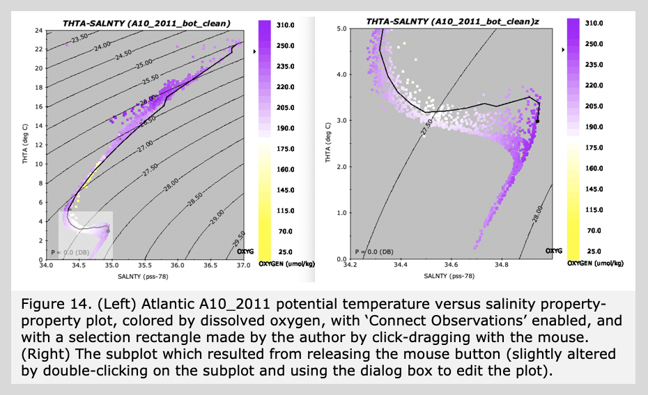

	<h1>Guided Tour of Java OceanAtlas </h1>
	<h2>{{page.title}}</h2>
	

You can 'select' a portion of a plot in the same way rectangular areas are selected in typical drawing and painting programs.

Click inside an active property-property plot at one corner of the area you wish to select, hold down the mouse button, and drag the mouse over some of the points to the opposite corner of the area you want selected. See how you 'selected' an area? Now release the mouse button. You will now see your selection in a new window, itself resizable and distortable, and you can double-click on that plot to view and/or change the ranges.

In Figure 14 we show the THTA vs. SALNTY plot, on the left as originally generated (except that we turned off the color legend), but after moving the browser around with the arrow keys. We have made a selection (the rectangle in the lower left of the plot), and show on the right the plot made when the mouse button was released.

Try browsing by holding down the right or left arrow keys, going back and forth across the section. You will soon learn that the stations on the left (west) show the more extreme warm, salty, high oxygen characteristics in the deep salinity maximum (from North Atlantic Deep Water). You can also examine the spatial patterns of the low salinity Antarctic Intermediate Water above. Try clicking on specific data points, for example find the freshest Antarctic Intermediate Water point, and then examine all the other plots and the Data Window. You will see that this was observed at 899 decibars at station 105, in the western part of the section, not far off the slope where the water was a 4000 meters deep. It does not correspond one-to-one with the intermediate silicate maximum, which is about 400-500 meters (decibars) below it, but is near a local vertical maximum in dissolved oxygen. (To see this you may need to generate an O2 vs. PRES or THTA plot.) Now try the same for the warmest North Atlantic Deep Water point. You will see that it was observed at 1799 decibars at station 109, close by, just above a minimum in silicate and a maximum in dissolved oxygen.

Why are these two extremes, one each from the north and south, both present near on the western boundary? Both are carried to this location from afar by western boundary currents. In simplest terms, the earth's rotation causes certain mass-compensating north-south flows to be carried along the western boundaries. These are good examples. The details of the relationships of the different parameters and their extrema are what research articles are made of. You can see that Java OceanAtlas can help you find and explore these relationships.

		
     
		
        
<h1>Guided Tour of Java OceanAtlas</h1>
<ul>
<li><a href="basic_features.html">Basic Features</a></li>
<li><a href="starting_joa.html">Starting JOA</a></li>
<li><a href="station_maps.html">Station Maps</a></li>
<li><a href="profile_plots.html">Profile Plots</a></li>
<li><a href="changing_color_bar.html">Changing Color/Contour Bar</a></li>
<li><a href="calculate_parameters.html">Calculate Parameters</a></li>
<li><a href="property_plots.html">Property-Property Plots</a></li>
<li><a href="browsing.html">Browsing</a></li>
<li><a href="modifying_plots.html">Modifying Plots</a></li>
<li class="active"><a href="extracting_selections.html">Extracting Selections</a></li>
<li><a href="contour_plots.html">Contour Plots</a></li>
<li><a href="other_features.html">Other Features</a></li>
<li><a href="more_about_maps.html">More About Maps</a></li>
<li><a href="how_to_filter_your_data.html">How to Filter Your Data</a></li>
<li><a href="final_remarks.html">Final Remarks</a></li>
<li><a href="joa_data_files.html">Java OceanAtlas Data Files</a></li>
</ul>

<a class="cta-btn align-middle" href="joa.html">Explore</a>

				
       
			

