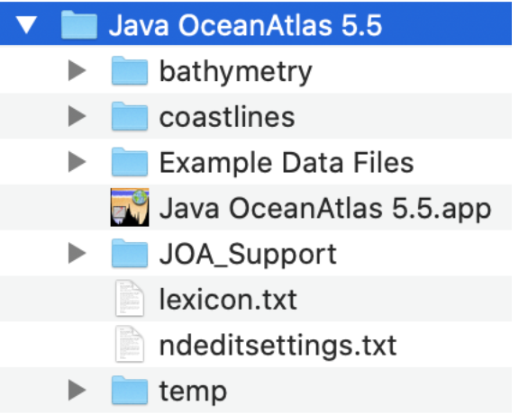

<!DOCTYPE html>
<html lang="{{ site.lang | default: "en-US" }}">



  <body>

     

        

	<h1>Java OceanAtlas Application</h1>
	<h2>Download and installation instructions</h2>
	

  Java OceanAtlas (JOA) is a computer application written in Java.  JOA and its
  support files must be installed on your computer.  JOA cannot be opened/run
  from removable media such as a CD or DVD, nor can it be opened/run over a
  network.

 Installing JOA is accomplished by mainly unzipping a zip file or disk image on macOS or launching the JOA installer on Windows. See the platform specific installation instructions. A JOA installation is composed of the JOA application and its support files in a single folder/directory.

Once you have installed JOA, you should have a folder/directory on your
computer with these contents:

Mac

  

Windows

  

  Most of these are essential - the JOA application itself will not run without
  information it looks for in some of the other files - and so all must be
  co-located in the same folder/directory on your computer.

<h3 id="support_files">Support Files</h3>
<h4>Bathymetry Add-ins</h4>

  If you would like to add higher-resolution ETOPO files, download any or all
  of these files and unzip them into the JOA_Support folder/subdirectory on
  your computer.

  Java OceanAtlas contains ETOPO-60 and ETOPO-20 files. These are binary files
  extracted from ETOPO-5 with bathymetry and elevations at 5-minute spatial
  resolution.

    
      
  

  



</body>
</html>
