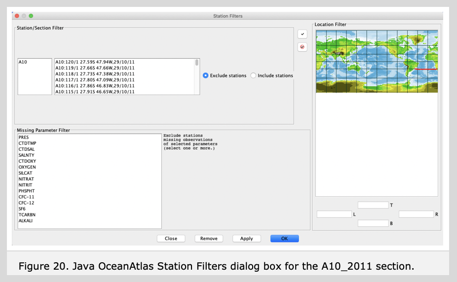

	<h1>Guided Tour of Java OceanAtlas </h1>
	<h2>{{page.title}}</h2>
	

Java OceanAtlas provides extensive capabilities for filtering data. Filtering allows one to focus on specific data of interest. Two types of data filters are available under the Filters menu. (A third type of filtering called 'enhancement' is described in the User Guide.)

Station Filters (illustrated in Figure 20) select (or de-select) stations:
	<ul>

<li>The 'Station Selection Filter' allows one to choose stations to exclude or include by clicking on the header to choose one station, by shift-clicking to choose a contiguous list of stations, or by control-clicking on multiple headers to choose a discontiguous list of stations.</li>

<li>The 'Missing Parameter Filter' permits the user to exclude stations which do not have at least one reported value for a specified parameter. Why do this? Some oceanographic sections contain only occasional stations for a more exotic parameter (admittedly use of the word 'exotic' lies in the eyes of the beholder) such as radiocarbon, helium, or tritium. Where data are missing for a given parameter when it is used to color plots, Java OceanAtlas colors the missing values by a pre-set color (a gray color in a 'factory fresh' copy of Java OceanAtlas). In contour plots, which are interpolated, a lot of missing data can make for a poor-looking plot. So by selecting name of the sparsely-sampled parameter, and excluding all stations without at least one value for that parameter, the user can make plots of that parameter look better.</li>

<li>The 'Location Filter' offers the capability to filter out all data outside a selected region. The region can be chosen via a selection rectangle or by typing in latitude and longitude limits.</li>
</ul>

 

Clicking the 'OK' closes the dialog and applies the selected conditions to the data, 'Remove' cancels the current station filter, 'Apply' applies the selected conditions to the data but does not close the dialog, and 'Close' closes the dialog box without performing any actions. 

 
The 'Observation Filter' permits the user to, on all plots, exclude data outside of up to two nested 'and/or' parameter range conditions each containing a nested 'and/or' choice, or to highlight the matching observations indicated by those same choices. It also works fine with a single parameter choice and range. 

 
With the Atlantic A10_2011 data set open in the Data Window, open the 'Observation Filter' dialog box from the Filters menu. In the first (top) condition, select 'SILCAT' to filter by, and type in '50' and '150' for the lower and upper limits, respectively. Now click on 'OK'. Figure 21 shows the Observation Filter dialog box with these entries and the resulting effect of this filter on the contour plot of SALNTY on PRES from the Atlantic A10_2011 data set.

The filtered salinity section plot now shows only those data where silicate is between 50-150 μmol/kg.

This rather neatly pared out the low-silicate upper layer and North Atlantic-origin layers. The remaining colored portions of the section plot now show the salinity structure within the nominal southern-origin waters in the section.

    
     
    
        
<h1>Guided Tour of Java OceanAtlas</h1>
<ul>
<li><a href="basic_features.html">Basic Features</a></li>
<li><a href="starting_joa.html">Starting JOA</a></li>
<li><a href="station_maps.html">Station Maps</a></li>
<li><a href="profile_plots.html">Profile Plots</a></li>
<li><a href="changing_color_bar.html">Changing Color/Contour Bar</a></li>
<li><a href="calculate_parameters.html">Calculate Parameters</a></li>
<li><a href="property_plots.html">Property-Property Plots</a></li>
<li><a href="browsing.html">Browsing</a></li>
<li><a href="modifying_plots.html">Modifying Plots</a></li>
<li><a href="extracting_selections.html">Extracting Selections</a></li>
<li><a href="contour_plots.html">Contour Plots</a></li>
<li><a href="other_features.html">Other Features</a></li>
<li><a href="more_about_maps.html">More About Maps</a></li>
<li class="active"><a href="how_to_filter_your_data.html">How to Filter Your Data</a></li>
<li><a href="final_remarks.html">Final Remarks</a></li>
<li><a href="joa_data_files.html">Java OceanAtlas Data Files</a></li>
</ul>

<a class="cta-btn align-middle" href="joa.html">Explore</a>

				
       
			

