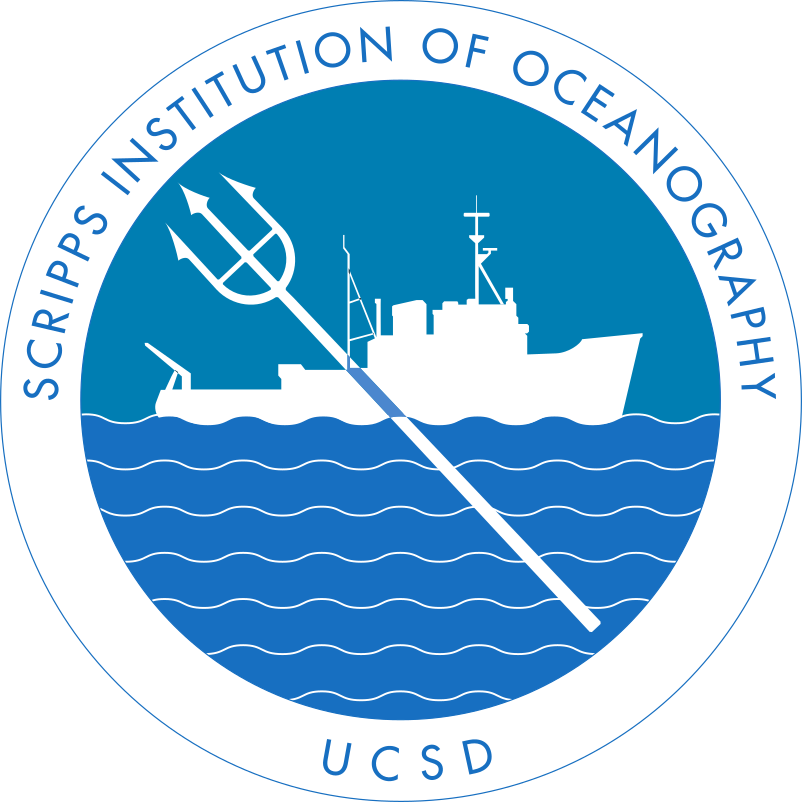
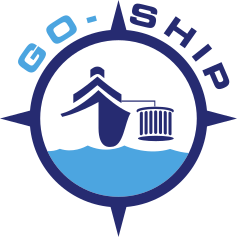

<link rel="stylesheet" href="/assets/css/main.css">
<section id="hero">
  

         
      <h1>{{page.title}}</h1>
      <h2>{{page.description}}</h2>
          

                
        <a href="Data_homepage" class="btn-get-started">Dive in &rarr;</a>
      

           
      

        <a href="#call-to-action" class="btn-get-started1">Archives</a>
        &nbsp;&nbsp;&nbsp;&nbsp;&nbsp;&nbsp;&nbsp;&nbsp; &nbsp;&nbsp;&nbsp;&nbsp;&nbsp;&nbsp;&nbsp;&nbsp;&nbsp;&nbsp;&nbsp;&nbsp;&nbsp;&nbsp;&nbsp;&nbsp;&nbsp;&nbsp;&nbsp;&nbsp;&nbsp;&nbsp;&nbsp;&nbsp;
        <a href="#facts" class="btn-get-started1">Statistics</a>
        &nbsp;&nbsp;&nbsp;&nbsp;&nbsp;&nbsp;&nbsp;&nbsp; &nbsp;&nbsp;&nbsp;&nbsp;&nbsp;&nbsp;&nbsp;&nbsp;&nbsp;&nbsp;&nbsp;&nbsp;&nbsp;&nbsp;&nbsp;&nbsp;&nbsp;&nbsp;&nbsp;&nbsp;&nbsp;&nbsp;&nbsp;&nbsp;
        <a href="#contact" class="btn-get-started1">Contact</a>
      

</section>

<main id="main">

<!--==========================
  About Us Section
============================-->
<section id="about">
  

    

      

        <h2 class="title">{{page.section_1.title}}</h2>
        

          The Java OceanSuite includes
            <ul>
                <li>Downloads, documentation and support files for the Java OceanAtlas (JOA) application for Windows and MacOS,</li>
                <li>an extensive collection of groomed World Ocean vertical profile water sample and CTD data in ASCII WHP-Exchange and JOA binary formats,</li>
                <li>a virtual research cruise to the far southeast Indian Ocean aboard SIO's R/V Roger Revelle, and</li>
                <li>suggestions and support for data analysis and exploration projects.</li>
            </ul>
        

      

    

  

</section><!-- #about -->

    <section id="about" style="background:black">
  

    

      

        <h2 class="title" style="color:white;text-align:right">{{page.section_2_title}}</h2>
        

          Java OceanAtlas (JOA) is a Java application for Windows and MacOS which provides an ad hoc (rather than pre-set) graphic exploration environment optimized to examine and plot oceanographic profile data. JOA works with any pressure- or depth-indexed data, for example 'WHP-Exchange' data, such as from the CLIVAR and Carbon Hydrographic Data Office (CCHDO;<a href="https://cchdo.ucsd.edu/">https://cchdo.ucsd.edu</a>).
            
          Java OceanAtlas plots include property-property plots, maps, offset profiles (waterfall), contour plots, and plots of calculated values, using color-by-property-value as a plotted variable to aid interpretation. There is also a comprehensive data display window and extensive support for data editing and quality control functions. All Java OceanAtlas plots and the data window are linked and may be ‘browsed’ jointly by sample and/or station. Plots can be re-scaled, re-sized, or have their colored variable changed. Selected areas of profile, property-property, contour plots, maps, and station value plots can be extracted into new plots. Standard levels, scales, contours, and colors can be changed via user interfaces similar to those used in commercial applications. Java OceanAtlas provides data filtering and exporting. Many different types of calculations can be performed.
        

      

    

  

</section><!-- #about -->

<section id="about">
  

    

      

        <h2 class="title">{{page.section_3_title}}</h2>
        

          The data provided here were prepared to provide students and researchers a collection of the best available 'blue water' ocean vertical profiles. Most data are in both ASCII WHP-Exchange and Java OceanAtlas binary formats. We have added value to many of these data by organizing sections, by combining and deleting stations, and by correcting some errors. Note that we continually update the data, replacing data files with preferred versions or adding cruises, old and new, to the collection.
            
         The collection 'Best Vertical Section Data' contains some of the finest-quality vertical section bottle and CTD data yet obtained from the World Ocean, from WOCE, CLIVAR, GO-SHIP and other programs of similar focus and quality. Includes a compilation of matched section segments - crossings of the same path in one basin or region from different years.
            
          The collection 'World Ocean Atlas Data' contains vertical profile data extracted for mapping and vertical sections from various iterations of the NOAA/NCEI/NODC World Ocean Atlas data, originally on standard level surfaces on a 1-degree positional grid for the World Ocean.
            
          The collection 'Other Data Files' contains ≈2200 vertical sections from the original NODC data files contributing to SIO Professor Joseph Reid's pre-WOCE (pre-1990s) World Ocean data collection, an assortment of other pre-WOCE vertical section data of interest, a collection of Arctic Ocean and Nordic Seas data, and a special collection of data files meant to be used, chapter by chapter, with the DPO JOA Examples which accompany the Talley et al. textbook,<b>Descriptive Physical Oceanography.</b>
            
           &nbsp;&nbsp;&nbsp;&nbsp;<i>J.Swift</i>
        

      

    

  

</section><!-- #about -->

<!--==========================
  Facts Section
============================-->
   <section id="facts">
  

    

      <h3 class="section-title">Statistics</h3>
      
World Ocean Data cumulated into a nutshell

    

    

      

        {{page.ocean_counter}}
        
Oceans

      

      

        {{page.verticalsection_counter}}
        
Vertical Sections

      

      

        {{page.year_counter}}
        
Years of Cumulative Data

      

      

        {{page.cruise_counter}}
        
Cruises

      

    

  

</section><!-- #facts -->

<!--==========================
  Services Section
============================-->
<section id="services">
  

    

      <h3 class="section-title">Datasets</h3>
      
The data sets provided at this website were put together in order to provide Java OceanAtlas users a collection of the best available 'blue water' ocean vertical profile data for education and research use

    

    

      

        

          <h4 class="title"><a href="Data_homepage#call-to-action"><u>Vertical Section Data</u></a></h4>
          
Cleaned versions of some of the finest World Ocean vertical section CTD and bottle data yet obtained, for education and research use. WHP-Basin Scale Sections.

        

      

      

        

          <h4 class="title"><a href="Data_homepage#call-to-action1"><u>World Ocean Atlas Data</u></a></h4>
          
Temperature, salinity, oxygen, and nutrient data extracted from the Levitus et al. WOA averaged property fields; on sub-grids and on vertical sections.

        

      

      

        

          <h4 class="title"><a href="Data_homepage#call-to-action2"><u>Other Data Files</u></a></h4>
          
Pre-1990s sections for examining basin-scale ocean water properties, a collection of Arctic and Nordic Sea data, and a few custom-made data files.

        

      

    

  

</section><!-- #services -->

<!--==========================
Call To Action Section
============================-->
<section id="call-to-action">
  

    

      

        <h3 class="cta-title">Outreach</h3>
        
A virtual research cruise to the far southeast Indian Ocean aboard SIO's R/V Roger Revelle: tour the ship, watch videos of activities at sea and interviews with students, crew, techs, officers, and scientists, read the weekly reports, read the NSF proposal that funded the cruise, examine some aspects of the data, etc.

      

      

        <a class="cta-btn align-middle" href="{{'/outreach/virtualcruise/' | relative_url}}">Explore</a>
      

    

  

</section><!-- #call-to-action -->

<section id="contact">
  

    

      <h3 class="section-title">Contact Us</h3>
      

    

  

  <iframe src="https://www.google.com/maps/embed?pb=!1m18!1m12!1m3!1d3351.1581131516714!2d-117.25382838422442!3d32.867535780944706!2m3!1f0!2f0!3f0!3m2!1i1024!2i768!4f13.1!3m3!1m2!1s0x80dc0754e9b63c47%3A0xf54d1be123616ebe!2sDeep%20Sea%20Drilling%20West%20Building!5e0!3m2!1sen!2sus!4v1589926372098!5m2!1sen!2sus" width="100%" height="380" frameborder="0" style="border:0" allowfullscreen></iframe>

  

    

      

        

          

            <i class="fa fa-map-marker"></i>
            
Room #50 Deep-Sea Drilling West 2215 Downwind Way La Jolla, CA 92037

          

          

            <i class="fa fa-envelope"></i>
            
jswift @ucsd.edu

          

        

      

    

  

</section><!-- #contact -->

</main>

<footer id="footer">
  

    

    

  

  

    

      <!--
        All the links in the footer should remain intact.
        You can delete the links only if you purchased the pro version.
        Licensing information: https://bootstrapmade.com/license/
        Purchase the pro version with working PHP/AJAX contact form: https://bootstrapmade.com/buy/?theme=Regna
      -->
      
      
      
      
       
      <small>Any opinions, findings, and conclusions or recommendations expressed in this material are those of Dr James Swift and do not necessarily reflect the views of the supporting agencies.</small> 
    

  

</footer><!-- #footer -->

<a href="#" class="back-to-top"><i class="fa fa-chevron-up"></i></a>
