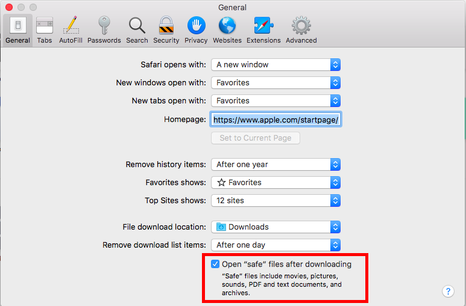
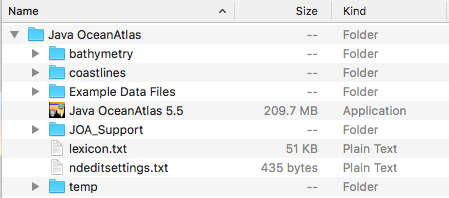
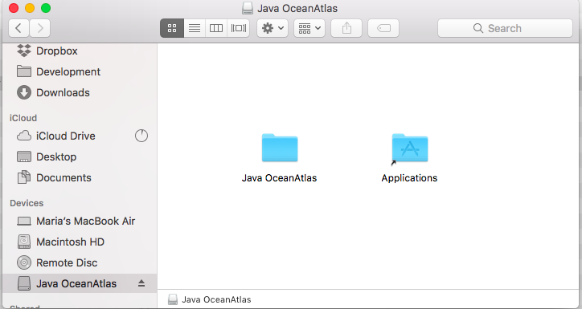
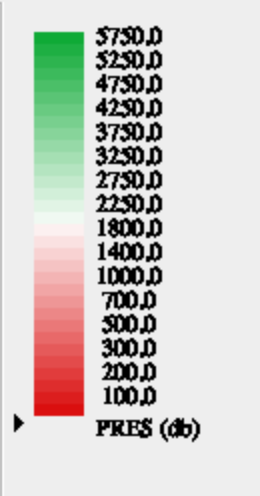
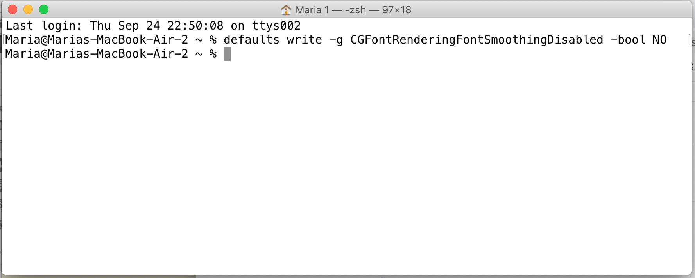

	

		

		<h1>Java OceanAtlas Application</h1>
		<h2>{{page.title}}</h2>
		<ul>
			<li>You do not have to install a separate Java environment for JOA 5.5 </li>
			<li>The installation process depends on what operating system you are using. To check what version of macOS is installed on your computer, go to the apple menu in the top left corner of your screen and select About This Mac. JOA 5.5 has been tested on versions 10.12-10.15, 11, 12, and 13  of macOS.</li>
			<li>The only difference in the "pro" version of JOA is that it requires a computer with at least 16 GB of RAM. This permits JOA to open full resolution versions of the largest global gridded data sets (reduced resolution versions are available, however).</li>
			<li>Due to Apple security protocols, JOA for MacOS 13 and above cannot be installed by direct download of the application. JOA can sometimes be installed via copying from a flash drive (both regular and pro versions). A more reliable installation method is via using the MacOS Terminal app to unpack the "tar" file available via download from this site (regular version only). [Either method should also work for Mac OSs 10.12 through 13, too.]</li>
			<li>The JOA folder (containing the JOA app and its support files) must be on your hard drive for JOA to run.</li>
		</ul>
		<h2>Installation on macOS Catalina (10.15), Big Sur (11), and Monterey (12) </h2>
		<ol>
			<li>You must download JOA 5.5 from Safari. Open Safari and go to Preferences. In the General tab, turn on Open “safe” files after downloading. This is necessary for JOA to install correctly.</li>
			 
			

			 
			<li>Download the Zip file.</li>
			<li>When the download is finished, there will be a folder called Java OceanAtlas in your Downloads folder that contains these files:</li>
			 
			

			 
			<li>Move or copy the Java OceanAtlas folder to the desired location on your computer. We recommend putting it in Applications.</li>
		</ol>
		<h2>Installation on macOS Sierra (10.12), High Sierra (10.13),  Mojave (10.14), Catalina (10.15), and Big Sur (11). Provisionally on macOS 12 (Monterey).</h2>
		<ol>
			<li>Download the DMG file </li>
			<li>Double click Java OceanAtlas.dmg to open it. You will see this window:</li>
			 
			

			 
			<li>Drag the folder called Java OceanAtlas to the provided link to your Applications folder, or to the desired location on your computer. Do not run JOA directly from the DMG.</li>
			<li>You will see these files in the Java OceanAtlas folder. You can now eject the DMG from finder or unmount it using the Disk Utility application. The DMG can be kept as a backup or discarded entirely.</li>
			 
			

		</ol>
		<h2>Installation on MacOS 13 and higher (and should also work for previous MacOS versions).</h2>
		<ol>
			<li><h4>Method A</h4>
			
JOA can sometimes be transferred via a flash drive from any MacOS computer where JOA is working OK.

			
To install Java OceanAtlas (JOA) for MacOS from a flash drive, copy the entire folder (for example, "Java OceanAtlas 5.5" or "Java OceanAtlas 5.5 pro") onto an appropriate location on your MacOS computer, such as the Applications folder or the Desktop. Copy the entire folder - not just the contents, but folder and all. Notes: (1) Keep the JOA contents together in the folder and (2) JOA will not work directly from the flash drive.

			
Note: Method A worked reliably until 2023, but there have now been verified reports of JOA failing to properly open after using this method.

			</li>
			<li><h4>Method B</h4>
			
Download the file "<a href="https://cchdo.ucsd.edu/data/41044/OceanAtlas5.tar.gz">OceanAtlas5.tar.gz</a>"

			
On your Mac, open/start the Terminal app (usually found in the Utilities folder of the Applications folder).

			
Using Terminal, use the command "cd" to change directories to whatever directory the file "OceanAtlas5.tar.gz" is in. Once there, use this command:
			<pre>tar -xzvf OceanAtlas5.tar.gz</pre>
			

			
Below are the contents of the Terminal window on J. Swift's computer, when the tar.gz file was on the desktop:
			<pre>Last login: Thu Sep 28 15:07:48 on ttys000
[jhswift:~] jamesswift% cd desktop
[jhswift:~/desktop] jamesswift% tar -xzvf OceanAtlas5.tar.gz</pre>
			After executing this command, a long list of files appears in the Terminal window. Look for the folder OceanAtlas5 on your Mac. That is your Java OceanAtlas folder. You can move it anywhere you wish but keep the contents together (in the folder).
			

			
Note: At the time this was prepared, the tar.gz of the "Pro" version of JOA was not successfully working with this method. If the tar.gz of the Pro version does appear on this site, that means we have fixed that problem.

			</li>
		</ol>
		<h2>Fixing Blurry Fonts in JOA</h2>
		
If you are using Mojave or Catalina, you may notice certain text to be poorly rendered and difficult to read, such as colorbar labels:
			 
			

			 
			<ol>
				<li>Quit JOA. Open Terminal (Terminal can be found in your /Applications/Utilities/ folder). You will see some text in your Terminal window. The gray box is your cursor.</li>
				<li>Copy and paste the following text into Terminal and press return:
					

						
defaults write -g CGFontRenderingFontSmoothingDisabled -bool NO

					

				</li>
				 
				

				 
				<li>After you press return, a new line of text with your computer and account name will appear. There will be nothing to indicate that a change has taken effect. Quit terminal and restart JOA. If text still appears fuzzy, try logging out of your account and logging back on.</li>
			</ol>
			<h2>System Requirements:</h2>
			
 JOA 5.5: macOS 10.12 or higher (may work under previous versions of macOS but has not been tested)
				  JOA 5.3: Mac OS X 10.10 or higher
				  4 GB of RAM (standard version) or 16 GB of RAM (pro version)

		

