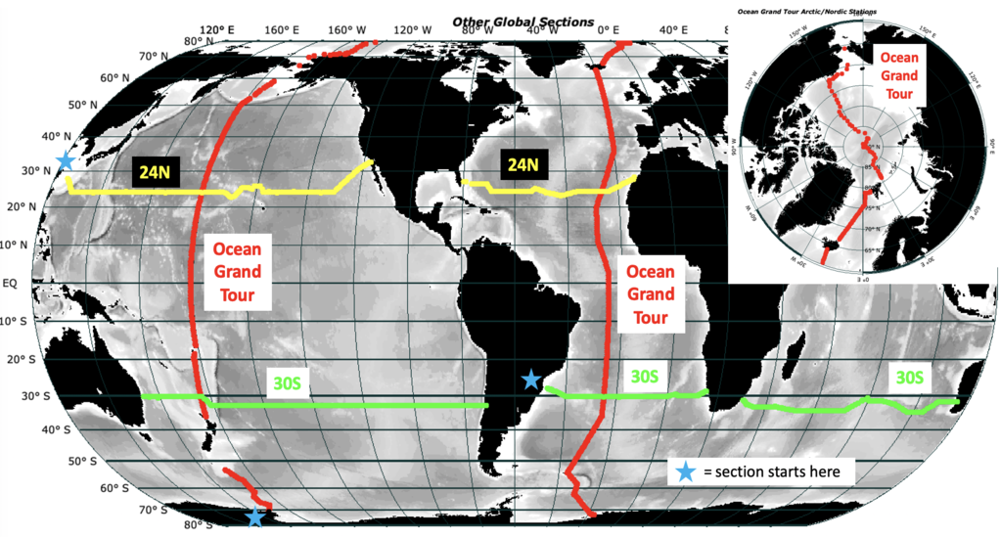

<section id="hero">
  

      
      <h1>Explore {{page.ocean}} Ocean Data</h1>
      <h2>Navigate to your desired data below</h2>
      

  

</section><!-- #hero -->

<section id="call-to-action1">
<section id="call-to-action3">
    

        

          <h3 class="cta-title1" style="text-align:center">About {{page.ocean}} Best Section Data</h3>
           
          
2200 mostly pre-1990 vertical sections based on SIO Professor Joseph Reid's World Ocean data collection. Other pre-1990s Atlantic, Indian, and Pacific basin scale sections, including from the highly-regarded GEOSECS, TTO, and SAVE expeditions. A collection of Arctic Ocean and Nordic Sea data is also provided.
 
       

      

</section>
</section><!-- #call-to-action -->

   <ul>
       <b><u>{{page.ocean}} Ocean</u></b>
           <ul>
              <li>	Download all {{page.ocean}} Data</li>
              
               <li>
               	<i class="fa fa-plus-square" style="color:white"></i>{{item.title}}
                 <ul>
                   <li>	Download all {{item.title}} Data</li>
                   
                     <li>	<i class="fa fa-plus-square" style="color:white"></i>{{entry.year}}
                         <ul>
                             <li> File </li>
                             <li> File </li>
                             <li> File </li>
                             <li> File </li>
                         </ul>
                     </li>
                    
                 </ul>
               </li>
               
   </ul>
   </ul>

