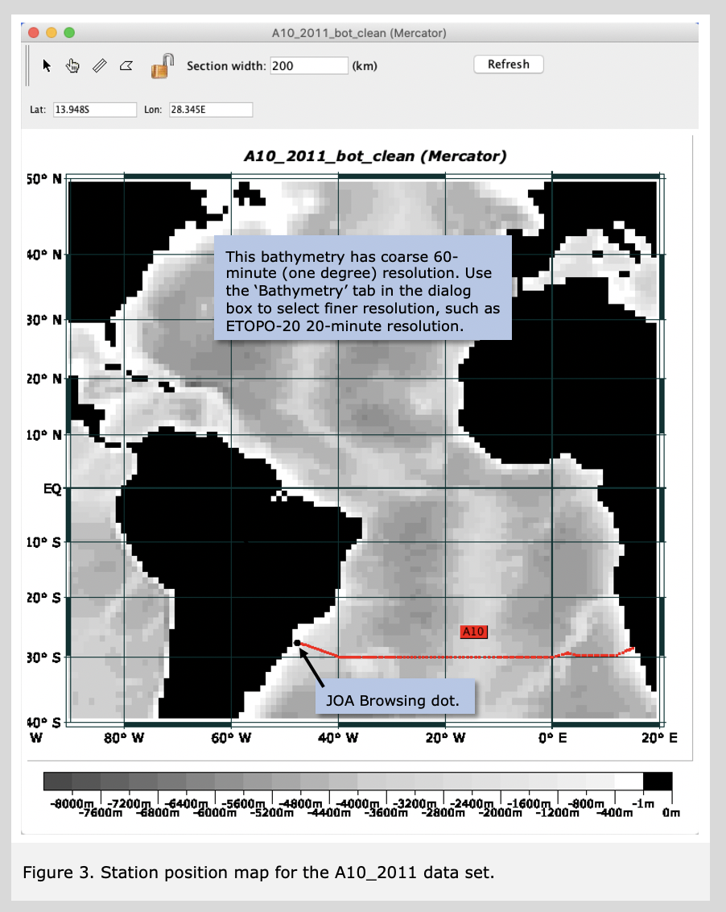

	<h1>Guided Tour of Java OceanAtlas </h1>
	<h2>{{page.title}}</h2>
	

Plots are the heart of the application. One of the first questions you might have would be &lsquo;where are these data located?&rsquo; Java OceanAtlas includes station maps.  
	Select &lsquo;Map...&rsquo; from the Plots menu. The will bring up the Configure Map Plot dialog box.

	We have configured the dialog boxes for each JOA plot type so that a basic plot can be made with a minimum of user input.
	  
	For a JOA map plot, no further user inputs are required: the &lsquo;Plot&rsquo; button is activated, meaning a basic map plot will be drawn by clicking on the &lsquo;Plot&rsquo; button.

Then click 'Plot'. You will see a map with the stations, shaded land masses, gray bathymetry, and a latitude/longitude grid, as shown in Figure 3.  
    

	

	

			
     
			
        
	<h1>Guided Tour of Java OceanAtlas</h1>
	<ul>
	<li class="active"><a href="1.html">Basic Features</a></li>
	<li><a href="2.html">Starting JOA</a></li>
	<li><a href="3.html">Station Maps</a></li>
	<li><a href="4.html">Profile Plots</a></li>
	<li><a href="5.html">Changing Color/Contour Bar</a></li>
	<li><a href="6.html">Calculate Parameters</a></li>
	<li><a href="7.html">Property-Property Plots</a></li>
	<li><a href="8.html">Browsing</a></li>
	<li><a href="9.html">Modifying Plots</a></li>
	<li><a href="10.html">Extracting Selections</a></li>
	<li><a href="11.html">Contour Plots</a></li>
	<li><a href="12.html">Other Features</a></li>
	<li><a href="13.html">More About Maps</a></li>
	<li><a href="14.html">How to Filter Your Data</a></li>
	<li><a href="15.html">Final Remarks</a></li>
	<li><a href="16.html">Java OceanAtlas Data Files</a></li>
	</ul>

	
<a class="cta-btn align-middle" href="joa.html">Explore</a>

	        
       
	      

	

