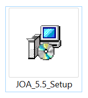
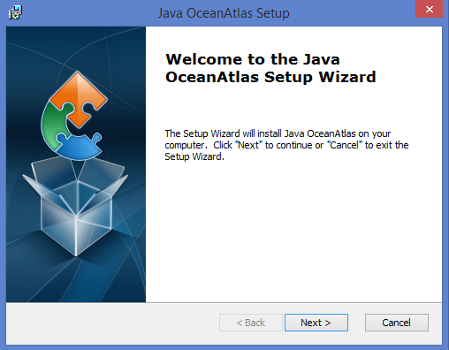
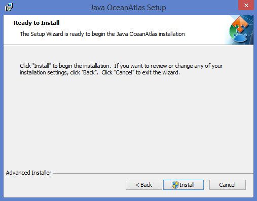

<h2>Installation</h2>

After downloading, just double-click installer icon to begin installation process: 

You will be presented with a series of dialogs to guide you through the installation process: 

Select an installation folder if different than the default: 

Click Install to install JOA onto your PC:   

Click Finish at the end of the installation process: 

<h3>Windows System Requirements</h3>

JOA 5.5: Microsoft Windows 10 (may work under earlier version of Windows but has not been tested) 
JOA 5.3: Microsoft Windows 8 or 8.1 (not tested under Windows 10) 
JOA 5.2.1: Microsoft Windows XP or Windows 7 
4 GB of RAM (JOA 5.5 standard version, earlier versions of JOA) or 16 GB of RAM (JOA 5.5 pro version)

